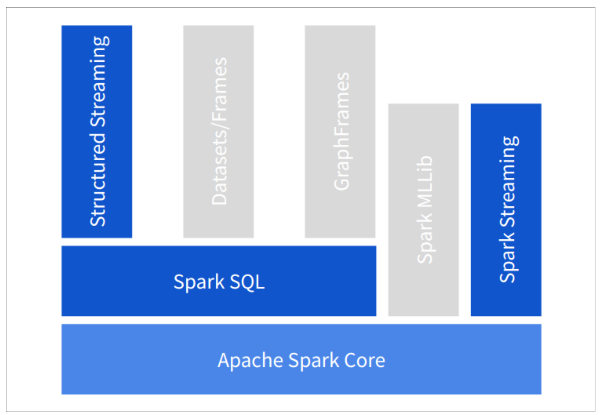
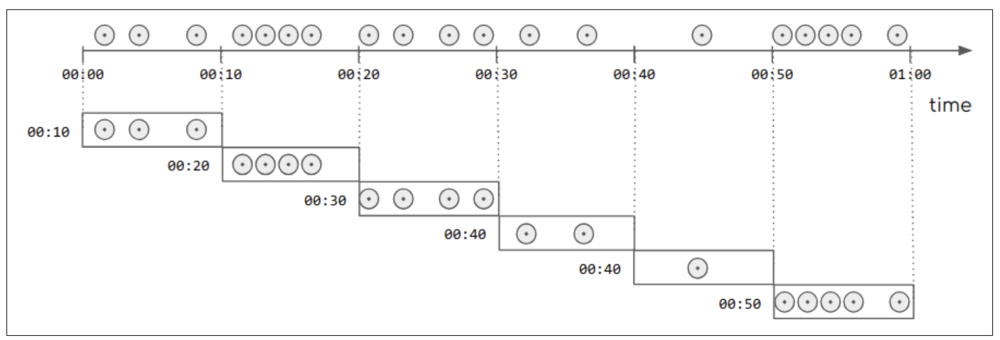
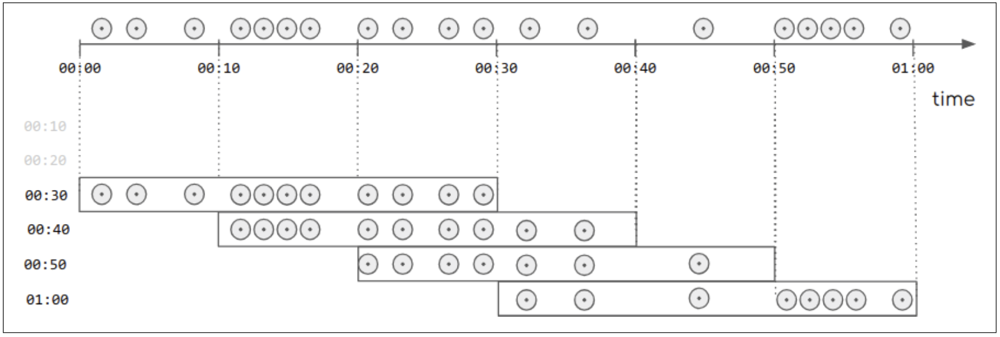
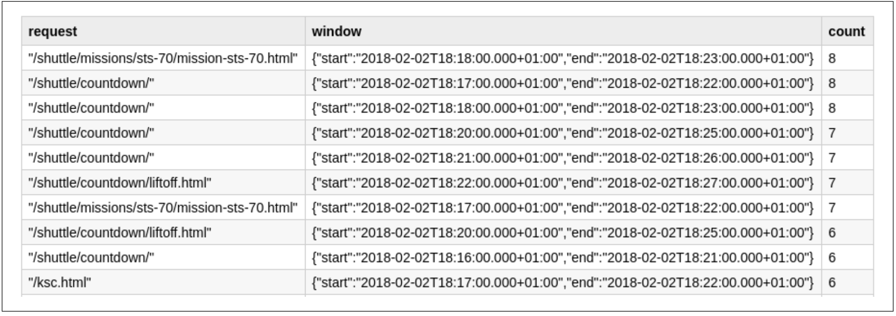
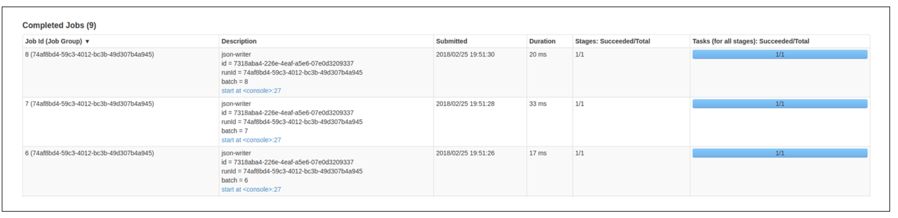

# 目录

- [第1部分 使用Apache Spark进行流处理的基础知识](#part-1)
  - [第1章 流处理简介](#chapter-1)
    - [什么是流处理](#what-is-stream-processing)
      - [批处理与流处理](#batch-versus-stream-processing)
      - [流处理中的时间概念](#time-in-stream-processing)
      - [不确定性因素](#the-factor-of-uncertainty)
    - [流处理用例](#examples-of-stream-processing)
    - [扩展数据处理](#scaling-up-data-processing)
      - [MapReduce](#mapreduce)
      - [经验教训:可伸缩性和容错](#lesson-learned)
  - [第2章 流处理模型](#chapter-2)
    - [数据源和数据接收器](#source-and-sink)
    - [不可变流](#immutable-streams)
    - [转换和聚合](#transformations-and-aggregations)
    - [窗口聚合](#window-aggregations)
      - [固定窗口](#tumbling-windows)
      - [滑动窗口](#sliding-windows)
    - [无状态处理和有状态处理](#stateless-stateful-processing)
    - [时间的影响](#effect-of-time)
  - [第3章 流式架构](#chapter-3)
- [第2部分 Structured Streaming](#part-2)
  - [第7章 Structured Streaming简介](#chapter-7)
    - [Structured Streaming的第一步](#first-step-structured-streaming)
    - [批处理分析](#batch-analysis)
    - [流处理分析](#streaming-analysis)
      - [连接到流](#connecting-to-stream)
      - [准备流中的数据](#prepare-data-int-stream)
      - [流数据集操作](#operation-on-streaming-dataset)
      - [创建一个查询](#create-a-query)
      - [启动流处理](#start-stream-process)
      - [探索数据](#exploring-data)
    - [总结](#chapter-7-summary)
  - [第8章 Structured Streaming编程模型](#chapter-8)
    - [初始化Spark](#initializing-spark)
    - [数据源](#acquiring-streaming-data)
      - [可用数据源](#available-sources)
    - [转换数据源](#transforming-streaming-data)
      - [DataFrame API在流处理中的限制](#streaming-api-restrction-on-dataframe-api)
    - [接收器：输出数据](#sink-output-the-resulting-data)
      - [format](#format)
      - [输出模式](#output-mode)
      - [queryName](#query-name)
      - [option](#option)
      - [options](#options)
      - [trigger](#trigger)
      - [start](#start)
    - [总结](#chapter-8-summary)
  - [第9章 Structured Streaming实战](#chapter-9)
    - [消费数据源](#consuming-streaming-data)
    - [业务逻辑](#application-logic)
    - [写入数据到接收器](#writing-to-streaming-sink)
    - [总结](#chapter-9-summary)

# <span id="part-1">第1部分 使用Apache Spark进行流处理的基础知识</span>

本书的第一部分为理解流处理的概念和`Apache Spark`流引擎理论奠定坚实的基础。

我们首先讨论当今企业采用流处理技术和系统背后的动机（第1章）。然后，我们建立流处理通用的词汇和概念（第2章）。接下来，我们讨论不同流架构的最新进展（第3章），并概述对`Apache Spark`作为流处理引擎的理论理解（第4章）。

如果想看具体的内容，读者可以直接跳到第二部分的`Structed Streaming`或第三部分的`Spark Streaming`。

对于那些喜欢在使用之前有更深了解的人，我们建议您在第5章中继续阅读Spark的分布式处理模型，其中我们奠定了核心概念，这些概念稍后将帮助您更好地了解`Spark Streaming`和`Structured Streaming`提供的不同的实现，选项和功能。

在第6章中，我们深入理解Spark所实现的弹性模型，以及它如何减轻开发人员的痛苦，实现运行7*24全天候企业关键工作负载的强大流应用程序。

有了这些新知识，我们准备使用Spark的两个流API，我们将在本书的后续部分中进行介绍。

<div style ="page-break-after：always;"> </div>

## <span id="chapter-1">第1章 流处理简介</span>

2011年，马克·安德森（Marc Andreessen）有句著名的话：“软件正在吞噬整个世界”，指的是蓬勃发展的数字经济，当时许多企业都面临着数字转型的挑战。使用“在线”和“移动”操作模式的在线业务正在接管传统的“实体店”。

例如，想象一下在照相馆里购买新相机的传统经验：我们会去照相馆逛逛，也许会问店员几个问题，下定决心，最后购买一个能满足我们要求的相机。购买完成后，商店将使用信用卡或现金进行交易，商店经理会知道他们的特定相机型号的库存减少了。

现在，让我们在线上体验一下：首先，我们开始搜索网络。我们访问了几个在线商店，当我们从一个地方转移到另一个地方时，留下了数字痕迹。网站上的广告突然开始向我们展示我们正在寻找的相机以及其他竞争产品的促销。我们终于找到了一家网上商店，为我们提供最优惠的价格并购买相机。我们会创建一个帐户。我们的个人数据会关联到购买记录。当我们完成购买后，网上商店会为我们提供其他选项，并告诉我们这些选项在购买同一相机的其他人中很受欢迎。我们的每次数字互动，例如在网络上搜索关键字，单击某些链接或花时间阅读特定页面，都会生成一系列事件，这些事件被收集并转化为业务价值，例如个性化广告或促销建议。

Dries Buytaert在2015年评论Andreessen的话时说：“实际上，数据正在吞噬整个世界。” 他的意思是，当今具有颠覆性的公司不再因为其软件，而是因为他们收集的独特数据以及将这些数据转化为价值的能力。

流处理技术的采用是由企业不断增长的需求推动的，企业需要缩短适应运营环境变化所需的时间。这种处理数据的方式提供了技术和战略优势。采用这种技术的例子包括：电子商务、连续运行的数据管道，这些数据管道是由与客户全天候互动的企业创建的，或者信用卡公司，在交易发生时进行分析，以便在欺诈活动发生时发现并制止。

流处理的另一个驱动因素是，我们生成数据的能力远远超过理解数据的能力。我们在个人和专业环境中不断增加具有计算能力的设备，如电视机、联网汽车、智能手机、自行车电脑、智能手表、监控摄像头、恒温器等。我们周围都是用来生成事件日志的设备：表示设备上下文中的动作和意外事件的消息流，这些动作和意外事件构成了设备历史的一部分。随着这些设备的互联越来越多，我们可以访问并分析这些事件日志。这种现象为近实时数据分析领域的创新打开了一扇令人难以置信的大门，前提是我们找到了一种使这种分析易于处理的方法。在这个聚集事件日志的世界中，流处理提供了最友好的方式来简化数据流的分析。

不仅数据正在吞噬世界，而且流式数据也在吞噬世界。

在本章中，我们将开始`Apache Spark`进行流处理的旅程。为了讨论`Spark`在流处理领域的能力，我们需要对什么是流处理、它的应用和它的挑战有一定的理解。在构建了该公共语言之后，我们将介绍`Apache Spark`，这是一个通用的数据处理框架，能够使用统一的模型处理批处理和流式处理。最后，我们将详细介绍`Spark`的流处理功能，其中我们将介绍两种流处理方式：`Spark Streaming`和`Structured Streaming`。我们简要地讨论了它们的显著特征，以便让您可以在本书的其余部分对它们有一个清晰的了解。

### <span id="what-is-stream-processing">什么是流处理</span>

流处理是从无限数据中提取信息的技术。

Tyler Akidau在他的`Streaming Systems`一书中对无限数据的定义如下：

`A type of dataset that is infinite in size (at least theoretically).`

考虑到我们的信息系统是建立在内存和存储容量等资源有限的硬件上的，它们不可能容纳无限的数据集，相反，我们的处理系统以事件流的形式接收数据，并随着时间的推移观察数据。我们称之为数据流。

另一方面，我们认为有界数据是一个已知大小的数据集。我们可以计算有界数据集中元素的数量。

#### <span id="batch-versus-stream-processing">批处理与流处理</span>

我们如何处理这两种类型的数据集？对于批处理，我们指的是有界数据集的计算分析。在实践中，这意味着这些数据集作为一个整体可以从某种形式的存储中获得。我们在计算过程开始时就知道数据集的大小，而且计算过程的持续时间是有限的。

与此相反，在流处理中，我们关注的是数据到达系统时的处理。由于数据流的无界性质，只要流还在传递新数据，流处理器需要持续运行。正如我们所了解到的，这可能是永远的过程。

流处理系统应用编程和操作技术，使在有限的计算资源下处理潜在的无限数据流成为可能。

#### <span id="time-in-stream-processing">流处理中的时间概念</span>

数据有两种形式：

- 静态数据，以文件的形式，数据库的内容，或其他类型的记录
- 动态数据，作为连续生成的信号序列，如传感器的测量或移动车辆的GPS信号

我们已经讨论过流处理程序是一个假定其输入可能是无限大的程序。更具体地说，流处理程序假设它的输入是一系列不确定长度的信号，随着时间的推移而观察到。

从时间轴的角度来看，静态数据是来自过去的数据:可以说，所有有边界的数据集，无论是存储在文件中还是包含在数据库中，最初都是随着时间推移收集到一些存储中的数据流。用户的数据库、上季度的所有订单、城市出租车行程的GPS坐标等等，都以收集在存储库中的单个事件开始。

试图对动态数据进行推理则更具挑战性。在数据生成的时间和系统处理时间之间有时间差。这个时间差可能非常短，就像在同一个数据中心中生成和处理的web日志事件，也可能更长，就像一辆通过隧道的汽车的GPS数据，只有在汽车离开隧道后重新建立无线连接时才会发送。

我们可以看到有两条时间轴：事件产生的时间轴和被流处理系统处理的时间轴。这些时间轴非常重要，所以我们给它们起了特定的名字：

- 事件时间

    事件产生的时间。时间信息由产生事件的设备的本地时钟提供。

- 处理时间

    流处理系统处理事件的时间。这是运行处理逻辑的服务器的时钟。它通常与技术原因有关，比如计算处理延迟或确定重复输出。

当我们需要关联、排序或聚合事件时，这些时间轴之间的差异就变得非常重要。


#### <span id="the-factor-of-uncertainty">不确定性因素</span>

在时间轴上，静态数据与过去有关，而动态数据可以被视为现在。但是未来呢?这个讨论的一个最微妙的方面是，它没有对系统接收事件时的吞吐量做任何假设。

一般来说，流处理系统不需要输入以固定的时间间隔产生，也不需要同时产生，也不需要遵循一定的节奏。这意味着，预测峰值负载是一个挑战:如何将输入元素的突然到来与处理它们所需的计算资源相匹配。

如果我们有足够的计算能力来匹配突发的输入数据，我们的系统将产生预期的结果，但如果我们没有预计到这样突发的数据，一些流处理系统可能会面临延迟、资源限制和故障。

处理不确定性是流处理的一个重要方面。

总之，流处理让我们可以从无限的数据流中提取信息，这些数据流是随着时间的推移被观察到的事件。然而，当我们接收和处理数据时，我们需要处理事件时间的额外复杂性和无限输入所带来的不确定性。

我们为什么要处理额外的麻烦?在下一节中，我们将回顾一些用例，这些用例说明了流处理的价值及可行性，从而在数据中找到业务价值。

### <span id="examples-of-stream-processing">流处理用例</span>

下面的用例只是一个很小的示例，我们用它来说明流处理的广泛应用：

- 设备监控

    一家小型初创公司推出了一款基于云计算的物联网(IoT)设备，可用于收集、处理和存储多达1000万台设备的数据。多个流处理器被部署到应用程序的不同部分，从使用内存存储的实时仪表盘，到连续的数据聚合，如去重计数和最小/最大测量。

- 故障检测

    大型硬件制造商应用复杂的流处理管道来接收设备指标。使用时间序列分析，潜在的故障被发现，纠正措施被自动发送回设备。

- 计费

    一家成熟的保险公司将其账单系统转移到了流式管道。从原来的批量处理到现在实时处理。

- 车队管理

    车队管理公司安装了能够报告被管理车辆的实时数据的设备，如位置、电机参数和燃油水平，使其能够执行地理限制等规则，并分析司机在限速方面的行为。

- 媒体推荐

    一家全国性的媒体公司部署了一个流媒体管道，将新视频(如新闻报道)输入其推荐系统，使得用户几乎在视频被输入该公司的媒体库后，就可以为其提供个性化的建议。该公司之前的系统需要数小时才能做到这一点。

- 贷款审批

    通过将多个数据流合并到一个流应用程序中，拥有贷款服务的银行能够将贷款批准从数小时减少到数秒。

这些用例中的一个共同主线是业务需要处理数据，并在接收数据后的短时间内可得到结果。这段时间与用例相关:虽然几分钟对于贷款审批来说是非常快的时间周期，但是在给定的服务级别阈值内，检测设备故障并发出纠正操作可能需要几毫秒的响应。

在任何情况下，我们都可以说，尽可能快地使用数据会更好。

现在，我们已经了解了什么是流处理，以及今天如何使用流处理的一些例子，是时候深入研究支撑流处理实现的概念了。

### <span id="scaling-up-data-processing">扩展数据处理</span>

在我们讨论流处理中分布式计算的含义之前，让我们先快速浏览一下`MapReduce`，这是一种计算模型，它为可伸缩和可靠的数据处理奠定了基础。

#### <span id="mapreduce">MapReduce</span>

分布式系统编程的历史在2003年2月经历了一个值得注意的事件。Jeff Dean和Sanjay Gemawhat，在经历了几次重写谷歌的爬虫和索引系统之后，开始注意到一些操作有共通之处。这使得他们开发了mapreduce，一种在谷歌里用于大型集群分布式处理的系统。

```
我们没有更早开发MapReduce的部分原因可能是，当我们在更小的规模上运行时，我们的计算使用更少的机器，因此健壮性并不是那么重要:定期检查一些计算并在机器死机时重新启动整个计算是很好的。然而，一旦你达到一定规模，这就变得相当站不住脚了，因为你总是重新开始，永远不会取得任何进展。
    —Jeff Dean, email to Bradford F. Lyon, August 2013
```

`MapReduce`首先是一个编程API，其次是一组组件，它使分布式系统的编程工作相对简单。

它的核心原则是两个函数:

- map

    map操作以一个函数作为参数，应用于集合的每个元素。集合的元素从分布式文件系统中读取，每个执行器一次读取一个块。然后，函数将应用于块中的所有元素，执行程序将输出该应用程序的结果。

- reduce

    reduce操作有两个参数:一个是当传递的是空集合时，返回什么。另一个是聚合操作，它对集合中的元素进行聚合。

这两个高阶函数的组合足以表达我们想在数据集上执行的每一个操作。

#### <span id="lesson-learned">经验教训:可伸缩性和容错</span>

从程序员的角度来看，`MapReduce`的主要优点是:

- 简单的API。
- 它提供了非常高的表现力。
- 应用开发人员不必关心分布式系统的难点，而交给库设计者。


尽管这些特点使该模式具有吸引力，但`MapReduce`的主要成功之处在于其维持增长的能力。随着数据量的增加和不断增长的业务需求导致了更多的信息提取工作，`MapReduce`模型展示了两个关键属性：

- 可扩展性

    随着数据集的增长，可以向机器集群添加更多的资源，以保持稳定的处理性能。

- 容错

    系统能够维持部分故障并从部分故障中恢复。所有数据是冗余的。如果携带数据的执行程序崩溃了，重新启动在崩溃的执行程序上运行的任务就足够了。因为主节点会跟踪该任务，所以除了重新调度之外，不会产生任何特殊问题。

这两个特性结合在一起，使得系统能够在一个根本不可靠的环境中持续维持工作负载，流处理也需要这些属性。

### 分布式流处理

使用`MapReduce`模型的流处理和使用批处理的一个基本区别是，批处理可以访问完整的数据集，但是流处理，我们在任何时候都只能看到数据集的一小部分。

这种情况在分布式系统中更加严重。也就是说，为了在一系列执行器中分配处理负载，我们进一步将输入流划分为多个分区。每个执行器只能看到完整流的部分视图。

分布式流处理框架面临的挑战是提供一个抽象，向用户隐藏这种复杂性，并让我们从整体上对流进行推理。

#### 分布式系统中的有状态流处理

让我们想象一下，我们正在清点总统选举的选票。经典的批处理方法是等待，直到所有的选票都被投出，然后继续计数。即使这种方法产生了一个正确的最终结果，它也会在当天造成非常无聊的新闻，因为直到选举过程结束后才知道结果。

一个更令人兴奋的场景是，我们可以将每个候选人的选票计算为每一张选票。在任何时候，我们都有参与者的部分计票，让我们看到当前的状况和投票趋势。我们或许可以预料到结果。

为了完成这个场景，流处理器需要内部寄存器保存到目前为止看到的投票。要确保计数一致，此寄存器必须能从多个部分失败中恢复。事实上，我们不能因为技术故障要求公民再次投票。

另外，任何故障恢复都不会影响最终结果。我们不能宣布出现一个错误的获胜候选人是因为一个恢复不良的系统。

这个场景说明了在分布式环境中运行有状态流处理所面临的挑战。有状态处理给系统带来了额外的负担：

- 我们需要确保状态随着时间的推移而保持。
- 我们要求数据一致性保证，即使在部分系统故障的情况下

正如您将在本书中看到的，解决这些问题是流处理的一个重要方面。

现在我们已经对流处理流行背后的驱动因素和这一学科的挑战性有了更好的认识，我们可以引入`Apache Spark`。作为一个统一的数据分析引擎，`Spark`为批处理和流处理提供了数据处理能力，这使它成为满足数据密集型应用程序需求的一个极好的选择。

### Apache Spark简介

`Apache Spark`是一个快速、可靠、容错的分布式计算框架，可用于大规模数据处理。

#### 函数式API

在早期，`Spark`是由其对内存和超强表达能力的函数式API的闻名的。Spark内存模型使用RAM来缓存正在处理的数据，从而使处理速度比`Hadoop MapReduce`快100倍，`Hadoop MapReduce`是谷歌的`MapReduce`的开源实现，用于批处理工作负载。

它的核心抽象，弹性分布式数据集(RDD)，带来了一个丰富的函数式编程模型，抽象出了集群上分布式计算的复杂性。它引入了转换和操作的概念，这些概念提供了比我们在`MapReduce`概述中讨论的map和reduce阶段更具表达性的编程模型。在这个模型中，许多可用的转换，如map、flatmap、join和filter表示数据从一种内部表示到另一种内部表示的惰性转换，而称为动作的操作则在分布式系统上实现计算以产生结果。

#### SQL

`Spark`项目历史上的第二个改变者是`Spark SQL`和`DataFrames`(以及后来的Dataset，一种强类型的DataFrame)的引入。从高级的角度来看，`Spark SQL`将SQL支持添加到任何具有模式的数据集。它使查询逗号分隔值(CSV)、Parquet或JSONdataset成为可能，就像我们用于查询SQL数据库的方式一样。

这种演变也降低了用户采用的门槛。高级分布式数据分析不再是软件工程师的专属领域;现在，数据科学家、业务分析师和其他熟悉sql的专业人士都可以访问它。从性能的角度来看，`Spark SQL`为`Spark`带来了查询优化器和物理执行引擎，使其在使用更少资源的情况下运行更快。

### 统一的引擎

现在，`Spark`是一个统一的分析引擎，提供批处理和流处理能力，兼容多语言的数据分析方法，提供scala、Java、Python和R语言的api。

虽然在本书的上下文中，我们将重点关注`Apache Spark`的流处理功能，但它的批处理功能同样先进，并且是对流应用程序的高度补充。`Spark`的统一编程模型意味着开发人员只需要学习一种新的范式就可以同时处理批处理和流处理工作负载。

### Spark组件

图1-1说明了`Spark`由核心引擎、构建在其之上的一组抽象(表示为水平层)和使用这些抽象来处理特定区域(垂直框)的库组成。高亮区域是这本书的内容，而那些没有被覆盖的区域用灰色表示。要了解更多关于`Apache Spark`的其他领域，我们推荐Spark、Bill Chambers和Matei Zaharia (O 'Reilly)的`The Definitive Guide`，以及holden Karau和Rachel Warren (O 'Reilly)的`High Performance Spark`。




以下是Spark中的抽象层：

- Spark Core

    包含`Spark`核心执行引擎和一组用于将计算分配到一个计算资源集群的低级别功能性api，在`Spark`行话中称为executors。它的集群抽象允许它将工作负载提交给YARN、Mesos和Kubernetes，也可以使用自己的独立集群模式，在这种模式下，spark作为一个专用服务运行在一个机器集群中。它的数据源抽象能够集成许多不同的数据提供者，如文件、区块存储、数据库和事件代理。

- Spark SQL

    实现`Spark`的高级Dataset和DataFrame api，并在任意数据源上添加sql支持。它还介绍了一系列通过`Catalyst`查询引擎的性能改进，以及`Tungsten`项目的代码生成和内存管理。

构建在这些抽象之上的库解决了大规模数据分析的不同领域:用于机器学习的MLLib，用于图形分析的GraphFrames，以及用于流处理的两个api，这是本书的重点:`Spark Streaming`和`Structured Streaming`。

### Spark Streaming

`Spark Streaming`是第一个建立在`Spark`核心引擎之上的流处理框架。它是在2013年2月的Spark 0.7.0版本中作为alpha版本引入的，经过一段时间的发展，现在已经成为一个成熟的API，业界广泛采用它来处理大规模数据流。

`Spark Streaming`的概念建立在一个简单而强大的前提之上:通过将连续的数据流转换为离散的数据集合，将`Spark`的分布式计算能力应用到流处理中。这种流处理方法被称为微批处理模型;这与在大多数其他流处理工具中占主导地位的`element-at-time`模型形成了对比。

`Spark Streaming`使用与`Spark`核心相同的函数式编程范式，但是它引入了一个新的抽象，离散流或DStream，它公开了一个编程模型来操作流中的底层数据。

### Structured Streaming

`Structured Streaming`是构建在`Spark SQL`抽象之上的流处理器。它通过流功能扩展了Dataset和DataFrame api。因此，它采用了面向schema的转换模型，该模型赋予了其名称的结构化部分，并继承了在`Spark SQL`中实现的所有优化。

2016年7月，Spark 2.0引入了`Structured Streaming`作为实验性API。一年后，随着Spark 2.2发行版的发布，它达到了普遍可用性，成为生产部署的合格条件。作为一个相对较新的发展，`Structured Streaming`仍在每一个新版本的`Spark`中快速发展的。

`Structured Streaming`使用声明式模型从一个流或一组流中获取数据。要充分使用API，需要为流中的数据指定schema。除了支持Dataset和DataFrame api提供的通用转换模型之外，它还引入了特定于流的特性，如对事件时间、流连接和底层runtime分离的支持。最后一个特性为实现不同执行模型的runtime打开了大门。默认实现使用经典的微批处理方法，而最近的连续处理后端带来了对近实时连续执行模式的实验性支持。

`Structured Streaming`提供了一个统一的模型，将流处理带到面向批处理的应用程序的同一级别，消除了大量关于流处理推理的认知负担。

### 下一站？

如果你想马上学习这两个api中的任何一个，你可以直接跳到第二部分的`Structured Streaming`或者第三部分的`Spark Streaming`。如果您不熟悉流处理，我们建议您继续阅读本书的第一部分，因为我们将构建讨论特定框架时使用的词汇表和公共概念。

<div style ="page-break-after：always;"> </div>

## <span id="chapter-2">第2章 流处理模型</span>

在本章中，我们会将数据流的概念(“移动”的数据源)与我们表达流处理的编程语言原语和结构联系起来。在讨论`Apache Spark`如何表示这些概念之前，我们首先要描述一些简单、基本的概念。具体来说，我们希望涵盖以下流处理的组成部分:

- 数据源
- 流处理管道
- 数据接收器

然后，我们将展示这些概念如何映射到`Apache Spark`实现的特定流处理模型。

接下来，我们描述了有状态流处理的特征，这种流处理需要以中间状态的形式记录过去的计算，并以此计算新数据。最后，我们考虑基于事件时间的流和处理诸如“如果这些事件的到达顺序和及时性不符合预期，我该怎么办?”

### <span id="source-and-sink">数据源和数据接收器</span>

正如我们之前提到的，`Apache Spark`在它的两个流媒体系统中(`Structured Streaming`和`Spark Streaming`)都是一个包含Scala、Java、Python和R编程语言api的编程框架。它只能对使用这个框架进入程序运行时的数据进行操作，一旦数据被发送到另一个系统，它就停止对数据进行操作。

你可能很熟悉处理静态数据的概念:为了操作以文件形式存储的数据，我们需要将该文件读入内存，以便对其进行操作，一旦我们通过计算机对该数据产生输出，我们就有能力将结果写入另一个文件。同样的原理也适用于数据库 - 另一个静态数据的例子。

类似地，在`Apache Spark`的流框架中，可以使用流数据源的概念来访问数据流。在流处理上下文中，访问流中的数据通常被称为消费流。这个抽象被描述为一个接口，允许实例的实现来连接特定的系统:Apache Kafka， Flume， Twitter， TCP套接字等等。

同样，我们将`Apache Spark`控制之外用于写入数据流的抽象称为流接收器。`Spark`项目本身以及第三方生态系统(开源和商业)提供了许多连接器用于连接到各种特定系统。

在图2-1中，我们说明了流处理系统中的数据源和数据接收器的概念。处理组件从源使用数据，并将最终结果生成到接收器。


源和接收器的概念代表了系统的边界。这种系统边界的标记是有意义的，因为完整的分布式系统是很复杂的。例如，可以将一个`Apache Spark`集群连接到另一个`Apache Spark`集群，或者连接到另一个分布式系统，`Apache Kafka`就是一个常见的例子。在这种情况下，一个框架的接收器就是下游框架的源。这种链接通常称为管道。源和接收器的名称对于描述从一个系统到另一个系统的数据传递以及在单独讨论每个系统时都很有用。

### <span id="immutable-streams">不可变流</span>

在源和接收器之间是流处理框架。我们不想现在深入到这个主题，你将看到他们出现在第二部分(`Structured Streaming`)和第三部分(`Spark Streaming`)，但是我们可以介绍一些概念，这些概念对理解如何表示流处理很有用。

`Apache Spark`中的两个流api都采用了函数式编程的方法:它们声明了在数据流上操作的转换和聚合，并假设这些流是不可变的。因此，对于一个给定的流，不可能改变它的一个或多个元素。相反，我们使用转换来表示如何处理一个流的内容以获得新的数据流。这确保了在程序中的任何给定点，任何数据流都可以通过在程序中显式声明的一系列转换和操作跟踪到其输入。因此，`Spark`集群中的任何特定进程都可以仅使用程序和输入数据重构数据流的内容，从而使计算变得明确和可重复。

### <span id="transformations-and-aggregations">转换和聚合</span>

`Spark`广泛使用转换和聚合。转换是对流中的每个元素以相同的方式表示自己的计算。例如，将其输入流的每个元素加倍对应于一个转换。另一方面，聚合产生的结果依赖于许多元素，甚至可能依赖到目前为止观察到的流中的每个元素。例如，收集输入流的前5个最大数字对应于一个聚合。每10分钟计算一次读取的平均值也是聚合的一个例子。

另一种定义这些概念的方法是说转换具有`narrow dependencies`(为了产生输出的一个元素，你只需要输入的一个元素)，而聚合具有`wide dependencies`(要生成输出的一个元素，需要观察到目前为止遇到的输入流的许多元素)。这种区别是有用的。它让我们使用高阶函数产生结果。

尽管`Spark Streaming`和`Structured Streaming`有不同的表示数据流的方式，但它们操作的api在本质上是相似的。它们都以一系列转换的形式出现，应用于不可变的输入流，并产生输出流。


### <span id="window-aggregations">窗口聚合</span>

流处理系统通常用于实时场景:社交媒体消息、网页点击、电子商务交易、金融事件或传感器。我们的流式应用程序通常收集来自不同地方的日志，这些地方可能是零售位置或者普通应用程序的web服务器。虽然单独查看每一笔交易可能没有用处，甚至没有实际意义，但我们可能会对查看最近一段时间内事件的属性感兴趣，比如，过去的15分钟，或者过去的1小时，或者两者都有。

此外，流处理系统应该是长时间运行着，不断处理连续的数据流。随着新事件不断出现，老事件与要处理的任务越来越不相关。

我们发现很多基于时间聚合的应用都可以使用窗口。

#### <span id="tumbling-windows">固定窗口</span>

窗口聚合最自然的方式是固定窗口。例如，“每小时的最高和最低环境温度”或“每15分钟的总能耗(kW)”。注意时间周期是连续和不重叠的。

当我们需要在固定的时间段内生成数据的聚合时，使用固定窗口，每个时间段都独立于之前的时间段。图2-2显示了在周期为10秒的窗口。




#### <span id="sliding-windows">滑动窗口</span>

滑动窗口由窗口长度和报告频率定义。例如，在最后一天的平均股价每小时报告。你可能已经注意到，这种滑动窗口与平均年龄函数是最广为人知的滑动窗口形式，通常被称为移动平均。

图2-3显示一个滑动窗口，窗口大小为30秒，报告频率为10秒。在图中，我们可以观察到滑动窗口的一个重要特征:它们在小于窗口大小的时间段内没有定义。我们可以看到00:10和00:20的时间没有报告窗口。



虽然在最后的插图中看不到，但是绘制图表的过程揭示了一个有趣的特性:我们可以通过添加最新的数据和删除过期的元素来构造和维护一个滑动窗口，同时保持所有其他元素的位置。

值得注意的是，固定窗口是滑动窗口的一种特殊情况，在固定窗口中，报告的频率等于窗口大小。

### <span id="stateless-stateful-processing">无状态处理和有状态处理</span>

我们用一个非常简单的例子说明了有状态和无状态流处理之间的区别，这个例子有使用这两种方法的解决方案。尽管有状态版本与定义非常相似，但它需要更多的计算资源:它需要遍历一个流并在每个步骤中保持中间值。

无状态版本使用了一种更简单的方法:我们使用一个无状态函数来获得结果。无论我们需要的斐波那契数是9还是999999，在这两种情况下，计算代价的顺序大致相同。

我们可以将这个想法推广到流处理。就其使用的资源而言，有状态处理的成本更高，并且在失败时也会引起关注:如果我们的计算在流的中途失败了，会发生什么?虽然一个安全的经验法则是选择无状态的选项，如果可行的话，我们在数据流中可以问的许多有趣的问题在本质上通常是有状态的。例如:用户在我们的网站上使用了多长时间?出租车穿过城市的路径是什么?工业机器上的压力传感器的移动平均值是多少?

在本书中，我们将看到有状态计算更加通用，但是它们有自己的约束条件。流处理框架的一个重要方面是提供设施来处理这些限制，并使用户能够创造业务需求所需的解决方案。

### <span id="effect-of-time">时间的影响</span>

到目前为止，我们已经考虑了在对数据流的每个元素产生结果时跟踪中间数据的优势，因为它允许我们分析数据流的每一个元素，只要我们将中间数据保持在一个有界的合理大小。现在，我们要考虑流处理特有的另一个问题，即基于事件时间的操作。


## <span id="chapter-3">第3章 流式架构</span>

<div style ="page-break-after：always;"> </div>

# <span id="part-2">Structured Streaming</span>

在这一部分中，我们将研究`Structured Streaming`。

我们将通过一个实际的示例来开始我们的旅程，该示例将帮助您建立模型。从这里开始，我们研究API并深入到流处理的以下方面的细节：

- 使用数据源消费数据
- 使用`DataFrame`/`Dataset` API构建数据处理逻辑
- 了解和处理事件时间
- 处理流式应用程序中的状态
- 了解任意状态转换
- 使用接收器将结果写入其他系统

在结束之前，我们将对`Structured Streaming`的操作方面进行概述。

最后，我们将探讨这个令人兴奋的新流式API的当前发展，并深入了解机器学习应用程序和连续流式近实时数据处理等领域。

## <span id="chapter-7">第7章 Structured Streaming简介</span>

在数据密集型企业中，我们发现了许多大型数据集:面向互联网的服务器的日志文件、购物行为表和带有传感器数据的NoSQL数据库，这只是其中的几个例子。所有这些数据集都有相同的生命周期:它们在某个时间点开始是空的，然后随着数据的产生存入某种形式的辅助存储，我们称之为数据流。然后，我们可以使用我们喜欢的分析工具对这些数据集进行静态处理，称为批处理的技术，因为它们一次性处理大量数据，通常需要相当多的时间来完成，从几分钟到几天。

`Spark SQL`中的`Dataset`就是分析静态数据的一种方法。它对于结构化的数据特别有用。也就是说，它遵循一个定义好的模式。`Spark`中的`Dataset API`结合了类sql形式API的表达能力和类型安全的集合操作，这让人想起Scala集合和弹性分布式数据集(RDD)编程模型。与此同时，与Python Pandas和R Dataframes相似的`DataFrame API`拓宽了`Spark`用户的受众，而不仅仅是那些习惯于在功能范式中进行开发的数据工程师。这种更高层次的抽象旨在支持现代数据工程和数据科学实践，使更广泛的专业人员能够使用熟悉的API进行大数据分析。

如果，我们可以在数据处于原始流形式时应用相同的`Dataset`概念，而不是等待数据“稳定下来”，那会怎么样呢?

`Structured Streaming`是数据集面向sql模型的扩展，用于处理动态数据:

- 假定源数据具有已定义的模式
- 事件流可以被看作是追加到无界表的行
- 为了从流中获得结果，我们将计算表达为对该表的查询
- 通过不断地对更新表应用相同的查询，我们创建了一个已处理事件的输出流
- 产生的事件被提供给输出接收器
- 接收器可以是一个存储系统，另一个流后端，或者是一个准备使用已处理数据的应用程序


在这个模型中，我们的无界表必须在一个资源有限的物理系统中实现。因此，该模型的实现需要一定的考虑和限制以应对潜在的无限数据流。

为了解决这些挑战，`Structured Streaming`在`Dataset`和`DataFrame` API中引入了新的概念，比如支持事件时间、水位线和不同的输出模式，这些输出模式决定了过去的数据实际存储多长时间。从概念上讲，`Structured Streaming`模型模糊了批处理和流处理之间的界限，消除了对动态数据进行分析的大量推理负担。

### <span id="first-step-structured-streaming">Structured Streaming的第一步</span>

在前一节中，我们学习了`Structured Streaming`的高级概念，如源、接收和查询。我们现在将从实践的角度来探索`Structured Streaming`，使用一个简化的web日志分析用例作为例子。

在我们开始深入研究我们的第一个流应用程序之前，我们将看看`Apache Spark`中的经典批处理分析如何应用于相同的用例。

这个练习有两个主要目标：

首先，大多数流数据分析都是从研究静态数据集合开始的。很容易从数据文件开始研究，直观了解数据模式以及定义从数据中提取预期知识所需的流程。通常情况下，只有在我们定义并测试了数据分析工作后，我们才能将其转换为流处理，以便将分析逻辑应用于动态数据。

其次，从实践的角度来看，我们可以看看`Apache Spark`如何通过使用统一的API来模拟从批处理到流处理应用程序的转换。

这一探索将允许我们对比Spark中的批处理和流式API，并向我们展示从批处理迁移到流处理。

```
线上资源

对于本例，我们使用NASA公布的1995年Apache Web日志，来自 http://ita.ee.lbl.gov/html/contrib/NASA-HTTP.html

在这个练习中，原始日志文件被拆分为天级文件，日志格式为JSON。NASA-weblogs文件可以从 https://github.com/stream-processing-with-spark 获得。

下载这个数据集，并将其放在您的计算机上的一个文件夹中。
```

### <span id="batch-analysis">批处理分析</span>

鉴于我们正在处理归档日志文件，我们可以一次访问所有数据。在我们开始构建流应用程序之前，让我们先来看看经典的批分析工作是什么样子的。

```
线上资源

对于本例，我们将使用该书在线资源中的batch_weblogs，网址是
https://github.com/stream-processing-with-spark
```

首先，我们从解压目录中加载日志文件，编码为JSON:

```
// This is the location of the unpackaged files. Update accordingly
val logsDirectory= ???
val rawLogs= sparkSession.read.json(logsDirectory)
```

接下来，我们将数据的模式声明为使用`Dataset API`的case类。日志的结构如下：

```
日志是一个ASCII文件，每个请求一行，包含以下列：

- 发出请求的主机。在可能的情况下使用主机名，否则如果无法查找该名称，则使用internet地址。
- 时间戳格式为“DAY MON DD HH:MM:SS YYYY”，其中DAY是一周中的一天，MON是月份的名称，DD是月份的一天，HH:MM:SS是一天中的时间，使用24小时制，YYYY是一年。时区是-0400。
- 请求，包含在引号中。
- HTTP code。
- 响应字节数。
```

Scala的case类定义如下：

```
import java.sql.Timestamp
case class WebLog(host:String,timestamp:Timestamp,request:String,http_reply:Int,bytes:Long)
//我们使用java.sql.Timestamp作为时间戳的类型，因为它是由Spark内部支持的，不需要任何其他可能的附加类型转换
```

我们使用前面的模式定义将原始JSON转换为类型化数据结构：

```
import org.apache.spark.sql.functions._
import org.apache.spark.sql.types.IntegerType

// we need to narrow the `Interger` type because
// the JSON representation is interpreted as `BigInteger`
val preparedLogs = rawLogs.withColumn("http_reply",$"http_reply".cast(IntegerType))
val weblogs = preparedLogs.as[WebLog]
```

既然我们有了结构化格式的数据，我们就可以开始处理我们感兴趣的问题了。作为第一步，我们想知道我们的数据集中包含了多少记录

```
val recordCount= weblogs.count
> recordCount:Long = 1871988
```

一个常见的问题是:“每天最流行的URL是什么?”要回答这个问题，我们首先将时间戳变为到一个月的第几天。然后我们根据这个新的dayOfMonth列和请求URL分组，并对这个聚合进行计数。我们最终使用降序排序，以获得top URLs

```
val topDailyURLs = weblogs.withColumn("dayOfMonth", dayofmonth($"timestamp"))
.select($"request", $"dayOfMonth").groupBy($"dayOfMonth", $"request")
.agg(count($"request").alias("count"))
.orderBy(desc("count"))

topDailyURLs.show()

+----------+----------------------------------------+-----+
|dayOfMonth|        request                         |count|
+----------+----------------------------------------+-----+
|        13|GET /images/NASA-logosmall.gif HTTP/1.0 |12476|
|        13|GET /htbin/cdt_main.pl HTTP/1.0         | 7471|
|        12|GET /images/NASA-logosmall.gif HTTP/1.0 | 7143|
|        13|GET /htbin/cdt_clock.pl HTTP/1.0        | 6237|
|         6|GET /images/NASA-logosmall.gif HTTP/1.0 | 6112|
|         5|GET /images/NASA-logosmall.gif HTTP/1.0 | 5865|
```

最热门的都是图片。现在该做什么?常见的是，网站中最常用的url是图片。我们真正感兴趣的是产生最多流量的内容页面。要找到它们，我们首先对html内容进行筛选，然后继续应用我们刚刚学习的top聚合。

正如我们所看到的，请求字段是一个引用序列`HTTP_VERB` `URL` `HTTP_VERSION`。我们将提取URL，并只保留以.html、.htm或非扩展名(目录)结尾的URL。这是本例的简化

```
val urlExtractor= """^GET (.+) HTTP/\d.\d""".r
val allowedExtensions=Set(".html",".htm", "")
val contentPageLogs= weblogs.filter {log => 
    log.requestmatch {
        case urlExtractor(url) => 
            val ext = url.takeRight(5).dropWhile(c => c != '.')
            allowedExtensions.contains(ext)
        case _ => false
    }
}
```


对于这个只包含.html、.htm和目录的新数据集，我们继续应用与前面相同的top-k函数

```
val topContentPages = contentPageLogs.withColumn("dayOfMonth", dayofmonth($"timestamp"))
.select($"request", $"dayOfMonth")
.groupBy($"dayOfMonth", $"request")
.agg(count($"request").alias("count"))
.orderBy(desc("count"))

topContentPages.show()

+----------+------------------------------------------------+-----+
|dayOfMonth|                                         request|count|
+----------+------------------------------------------------+-----+
|        13| GET /shuttle/countdown/liftoff.html HTTP/1.0"  | 4992|
|         5| GET /shuttle/countdown/ HTTP/1.0"              | 3412|
|         6| GET /shuttle/countdown/ HTTP/1.0"              | 3393|
|         3| GET /shuttle/countdown/ HTTP/1.0"              | 3378|
|        13| GET /shuttle/countdown/ HTTP/1.0"              | 3086|
|         7| GET /shuttle/countdown/ HTTP/1.0"              | 2935|
|         4| GET /shuttle/countdown/ HTTP/1.0"              | 2832|
|         2| GET /shuttle/countdown/ HTTP/1.0"              | 2330|
...
```

我们可以看到当月最受欢迎的页面是liftoff.html，对应于NASA档案中记载的发现号航天飞机发射的报道。

### <span id="streaming-analysis">流处理分析</span>

在前一节中，我们探讨了NASA网络日志的历史记录。我们在这些记录中发现了热门事件，但比实际事件发生的时间要晚得多。

流处理分析的一个关键驱动力来自于组织对实时信息日益增长的需求，这些信息可以帮助他们在许多不同的层面上做出决策。

我们可以利用我们所学到的经验教训，同时使用面向批处理的方法来探索归档记录，并创建一个流作业，使热门信息发生时我们就能知道。

我们在批处理分析中观察到的第一个差异是数据的来源。对于我们的流处理练习，我们将使用TCP服务器来模拟一个实时发送日志的web系统。模拟器将使用相同的数据集，但将通过TCP套接字连接提供数据，该连接将包含我们将要分析的流。

```
线上资源

对于本例，我们将使用 weblog_TCP_server 和 streaming_weblogs，可以在 https://github.com/stream-processing-with-spark 找到
```

#### <span id="connecting-to-stream">连接到流</span>

如果你还记得本章的介绍，`Structured Streaming`定义了源和接收器的概念，作为消费流和产生结果的关键抽象。我们将使用`TextSocketSource`实现通过TCP套接字连接到服务器。套接字连接是由主机服务器和它侦听连接的端口定义的。这两个配置是创建套接字源所必需的。

```
val stream = sparkSession.readStream
.format("socket")
.option("host", host)
.option("port", port)
.load()
```

请注意，流的创建与批处理中的静态数据源的声明非常相似。我们不使用`read`，而是使用`readstream`，并将源所需的参数传递给它。正如你将在这个练习过程中看到的，稍后当我们进入`Structured Streaming`的细节，API基本上和处理静态数据的`DataFrame`及`Dataset`API类似，但有一些修改和限制，你将详细了解。

#### <span id="prepare-data-int-stream">准备流中的数据</span>

套接字源产生一个带有列的`DataFrame`，其中包含从流接收到的数据。请参阅130页的“套接字来源”了解更多细节。在批量分析的情况下，我们可以直接将数据作为JSON记录加载。在Socket源的情况下，该数据是纯文本。要将原始数据转换为`WebLog`，首先需要一个模式。模式提供了将文本解析为JSON对象的必要信息。这就是我们所说的`Structured Streaming`的结构。

在为数据定义模式之后，我们继续按照以下步骤创建数据集

```
import java.sql.Timestamp
case class WebLog(host:String,timestamp:Timestamp,request:String,http_reply:Int,bytes:Long)
val webLogSchema = Encoders.product[WebLog].schema //1
val jsonStream = stream.select(from_json($"value", webLogSchema) as "record") //2
val webLogStream:Dataset[WebLog] = jsonStream.select("record.*").as[WebLog] //3
```

1. 从类定义获得模式
2. 使用`Spark SQL`内置的JSON支持将文本转换为JSON
3. 使用`Dataset` API将JSON记录转换为WebLog对象

通过这个过程，我们得到了一个`WebLog`记录的流数据集。

#### <span id="operation-on-streaming-dataset">流数据集操作</span>

我们刚刚获得的`webLogStream`类型是`Dataset[WebLog]`，就像我们在批量分析作业中所做的那样。这个实例和批处理版本的区别在于`weblogstream`是一个流数据集。

我们可以通过查询对象来观察这一点

```
webLogStream.isStreaming
> res:Boolean = true
```

在批处理作业上，我们创建了对数据的第一个查询:我们的数据集中包含多少记录?当我们能够访问所有数据时，这是一个很容易回答的问题。但是，我们如何计算不断到达的记录呢?答案是，我们认为通常在静态数据集上的一些操作，如计数所有记录，在流数据集上没有确定的含义。

正如我们可以观察到的，在下面的代码片段中尝试执行计数查询将导致一个`AnalysisException`：

```
val count= webLogStream.count()
> org.apache.spark.sql.AnalysisException:Querieswithstreamingsourcesmustbe executedwith writeStream.start();;
```

这意味着我们在静态`Dataset`或`DataFrame`上使用的直接查询现在需要两级交互。首先，我们需要声明我们的流的转换，然后我们需要启动。

#### <span id="create-a-query">创建一个查询</span>

什么是流行的URL?在什么时间内?现在我们有了对网络日志流的实时分析访问，我们不需要等待一天或一个月(对于这些NASA的网络日志来说，等待超过20年)来获得流行URL的排名。我们可以在更短的时间内获得这些信息。

首先，为了定义我们感兴趣的时间段，我们创建一个时间窗口。`Structured Streaming`的一个有趣特性是，我们可以基于数据产生的时间(也称为事件时间)，而不是数据被处理的时间创建窗口。

我们的窗口定义是5分钟的事件数据。考虑到我们的时间线是模拟的，这五分钟可能比时钟时间快或慢得多。通过这种方式，我们可以清楚地了解`Structured Streaming`是如何使用事件时间来跟踪事件时间轴的。

正如我们从批量分析中学到的，我们应该提取url并只选择内容页面，如.html、.htm或目录。让我们先应用所获得的知识，然后再定义窗口查询：

```
// A regex expression to extract the accessed URL from weblog.request
val urlExtractor = """^GET (.+) HTTP/\d.\d""".r
val allowedExtensions = Set(".html", ".htm", "")
val contentPageLogs:String => Boolean = url => {
    val ext = url.takeRight(5).dropWhile(c => c != '.')
    allowedExtensions.contains(ext)
}

val urlWebLogStream = webLogStream.flatMap { weblog => 
    weblog.requestmatch {
        case urlExtractor(url) if (contentPageLogs(url)) => 
            Some(weblog.copy(request= url))
        case _ => None
    }
}
```

我们已经将请求转换为只包含访问过的URL，并过滤掉了所有非内容页面。现在，我们定义窗口查询来计算最热门的URL。

```
val rankingURLStream = urlWebLogStream
.groupBy($"request", window($"timestamp", "5 minutes", "1 minute"))
.count
```

#### <span id="start-stream-process">启动流处理</span>

到目前为止，我们遵循的所有步骤都是定义流将经历的流程。但是还没有数据被处理过。

要启动`Structured Streaming`作业，需要指定接收器和输出模式。

这是`Structured Streaming`引入的两个新概念:

- 接收器定义了我们想在哪里物化结果数据;例如，文件系统，内存表，或另一个流系统，如Kafka。
- 输出模式定义了我们希望结果如何被交付:我们希望每次都看到所有数据，只更新，还是只看到新记录?

这些选项提供给`writeStream`。它创建流查询，该查询启动流消费，执行在查询上声明的计算，并将结果生成到输出接收器。

稍后我们将详细讨论所有这些概念。现在，让我们根据经验来使用它们并观察结果。

对于示例7-1所示的查询，每次向跟踪URL排名的结果中添加新记录时，我们使用`memory sink`和输出模式complete来拥有一个完全更新的表。

示例7-1。将流写入接收器

```
val query = rankingURLStream.writeStream
.queryName("urlranks")
.outputMode("complete")
.format("memory")
.start()
```

内存接收器将数据输出到queryName选项中给定的同名临时表。我们可以通过查询`Spark SQL`上注册的表来观察这一点。

```
scala> spark.sql("show tables").show()
+--------+---------+-----------+
|database|tableName|isTemporary|
+--------+---------+-----------+
|        | urlranks|       true|
+--------+---------+-----------+
```

在示例7-1的表达式中，查询的类型是StreamingQuery，它是一个控制查询生命周期的处理程序。

#### <span id="exploring-data">探索数据</span>

考虑到我们在不断生成日志，几秒之后，我们可以执行下一个命令来查看第一个窗口的结果，如图7-1所示。

注意处理时间(几秒)是如何从事件时间(几十分钟的日志)中分离出来的。

```
urlRanks.select($"request", $"window", $"count").orderBy(desc("count"))
```



我们将在第12章详细探讨事件时间。

### <span id="chapter-7-summary">总结</span>

在`Structured Streaming`的最初步骤中，您已经看到了流应用程序开发背后的过程。通过以批处理版本的过程开始，我们了解了数据处理流程，并创建了流处理版本。在这个过程中，你可以体会到批处理和流api是多么的接近，我们也观察到一些通常的批处理操作现在应用在流上下文中。

通过这个练习，我们希望能增加您对`Structured Streaming`的好奇心。现在您已经准备好开始进一步的学习。

<div style ="page-break-after：always;"> </div>


## <span id="chapter-8">第8章 Structured Streaming编程模型</span>

`Structured Streaming`构建在Spark SQL `DataFrame`和`Dataset` API之上。通过扩展这些API，`Structured Streaming`继承了Spark SQL引入的高级语言的特性以及底层优化，包括Catalyst查询优化器的使用以及Tungsten项目提供的低开销内存管理和代码生成。同时，`Structured Streaming`可以用在所有支持Spark SQL的语言中。像Scala，Java、Python和R，尽管一些高级特性目前仅在Scala中可用。由于Spark SQL中使用了中间查询表示，所以无论使用何种语言，程序的性能都是相同的。

`Structured Streaming`引入了对事件时间的支持，这使得很容易使用事件时间进行编程。

随着`Structured Streaming`的发展，Spark将经典批处理和流处理统一起来。

在本章中，我们通过遵循在`Structured Streaming`中创建流作业通常需要的一系列步骤来研究`Structured Streaming`的编程模型：

- 初始化Spark
- 数据源：获取流数据
- 声明应用在流数据上的操作
- 接收器：输出结果数据


### <span id="initializing-spark">初始化Spark</span>

Spark API统一的一部分是，`SparkSession`成为批处理和使用`Structured Streaming`进行流处理的统一入口点。

因此，我们创建Spark作业的入口点与使用Spark批处理API时相同:我们实例化一个SparkSession，如示例8-1所示

```
importorg.apache.spark.sql.SparkSession
val spark = SparkSession.builder().appName("StreamProcessing").master("local[*]").getOrCreate()
```

### <span id="acquiring-streaming-data">数据源</span>

在`Structured Streaming`中，数据源是一种抽象，它允许我们从流数据生成器中消费数据。数据源不是直接创建的。相反，`SparkSession`提供了一个方法`readStream`，该方法来指定数据源的格式，并提供相关配置。

例如，例8-2中的代码创建了一个File流源。我们使用`format`方法指定源文件的格式。`schema`方法允许我们为数据流提供一个模式，这对于某些源类型是必需的，比如File源。

```
val fileStream = spark.readStream
.format("json")
.schema(schema)
.option("mode","DROPMALFORMED")
.load("/tmp/datasrc")

>fileStream:org.apache.spark.sql.DataFrame = [id:string, timestamp:timestamp... ]
```


每个数据源都有不同的选项。在例8-2中，我们将选项模式设置为`DROPMALFORMED`。这个选项指示JSON流处理器删除任何既不符合JSON格式也不匹配提供的模式的行。

`readStream`创建一个`DataStreamBuilder`实例。这个实例负责管理不同选项。在这个`DataStreamBuilder`示例上调用`load(…)`将验证提供给构建器的选项，如果一切都检查好了，它将返回一个`DataFrame`。

- read/write：批处理
- readStream/writeStream：流处理

在我们的示例中，`DataFrame`表示数据流，Spark监视所提供的路径，将该路径中的每个新文件视作json编码，并使用所提供的模式进行解析。所有不符合的数据都将从这个数据流中删除。

加载数据源是惰性的。我们得到的是一个流的表示，在`DataFrame`上，我们可以使用一系列转换，以实现我们特定的业务逻辑。创建`DataFrame`不会导致任何数据被实际消费或处理。我们将使用一个查询来代表计算。


#### <span id="available-sources">可用数据源</span>

从Spark v2.4.0起，支持以下流源：

- `json, orc, parquet, csv, text, textfile`

    这些都是基于文件的数据源。基本功能是监控文件系统中的路径(文件夹)，并自动使用其中的文件。找到的文件将由指定的格式化程序解析。例如，如果提供了json, Spark json reader将使用提供的schema来处理文件。

- `socket`

    通过TCP连接连到服务器获取数据。

- `kafka`

    创建Kafka消费者以从Kafka检索数据。

- `rate`

    按照rowsPerSecond选项给出的速率生成行流。它主要用作测试。

将在第10章看到更详细的内容。

### <span id="transforming-streaming-data">转换数据源</span>

正如我们在前一节中看到的，调用load的结果是一个`DataFrame`。在我们创建`DataFrame`之后，我们可以使用`Dataset`或`DataFrame` API来表达我们想要应用到流数据的逻辑，以实现我们业务逻辑。

```
记住，DataFrame是Dataset[Row]的别名。虽然这看起来像是一个很小的技术区别，但当从Scala这样的类型化语言中使用时，Dataset API提供了一个类型化接口，而DataFrame使用是无类型化的。当从动态语言(如Python)中使用结构化API时，DataFrame API是唯一可用的API。

在类型化Dataset上使用操作也会影响性能。尽管查询规划器可以理解和进一步优化DataFrame API使用的SQL表达式，但Dataset操作中提供的闭包对查询规划器是不透明的，因此可能比对应的DataFrame运行得慢。
```

假设我们使用来自传感器网络的数据，在例8-3中，我们从sensorStream中选择deviceId、timestamp、sensorType和value字段，并保留那些传感器类型为温度且其值高于给定阈值的记录。

```
val highTempSensors = sensorStream
.select($"deviceId", $"timestamp", $"sensorType", $"value")
.where($"sensorType" === "temperature" && $"value" > threshold)
```

同样，我们可以随着时间的推移聚合数据并对组应用操作。例8-4表明，我们可以使用事件时间来定义一个5分钟的时间窗口，该窗口将每分钟滑动一次。我们将在第12章详细讨论事件时间。这里需要掌握的重要一点是，`Structured Streaming` API与批处理的Dataset API相同，但流处理有一些特别的限制。

```
val avgBySensorTypeOverTime = sensorStream
.select($"timestamp", $"sensorType", $"value")
.groupBy(window($"timestamp", "5 minutes", "1 minute"), $"sensorType")
.agg(avg($"value"))
```

如果您不熟悉Spark API，我们建议您熟悉它。对这个API的详细讨论超出了本书的范围。我们推荐Bill Chambers和MateiZaharia的《Spark: The Definitive Guide》(O 'Reilly, 2018)。

#### <span id="streaming-api-restrction-on-dataframe-api">DataFrame API在流处理中的限制</span>

正如我们在前一章中提到的，标准的`DataFrame`和`Dataset` API提供的一些操作在流处理中没有意义。

例如`stream.count`，在流处理中使用是没有意义的。一般来说，要求底层数据集立即的操作是不允许的。以下是流处理不直接支持的API操作：

- count
- show
- decribe
- limit
- take(n)
- distinct
- foreach
- sort
- multiple stacked aggregations

除了这些操作，流和流连接和静态数据和流的连接也只是部分支持。

##### 理解的局限性

尽管有些操作(如count或limit)在流处理中没有意义，但其他一些流操作在计算上是困难的。例如，distinct就是其中之一。要过滤任意数据流中的重复数据，就需要你记住到目前为止看到的所有数据，并将每个新记录与所有已经看到的记录进行比较。第一种情况需要无限的内存，第二种情况的计算复杂度为O(n2)，随着元素数量(n)的增加，计算复杂度变得难以实现。

##### 已聚合流上的操作

在将聚合函数应用于流之后，一些不受支持的操作将被定义。虽然我们不能对流进行计数，但我们可以计算每分钟接收的消息数或计算某种类型的设备的数量。

在例8-5中，我们定义了每分钟每个sensorType的事件数

```
val avgBySensorTypeOverTime = sensorStream
.select($"timestamp", $"sensorType")
.groupBy(window($"timestamp", "1 minutes", "1 minute"), $"sensorType")
.count()
```

同样，也可以对已聚合的数据定义排序，尽管它会进一步限制输出模式。

##### 重复数据删除

我们讨论过，在任意流上实现distinct在计算上是困难的。但是如果我们可以定义一个键来告诉我们数据已达到，我们可以用它来删除重复数据：

```
stream.dropDuplicates("<key-column>") ...
```

##### Workarounds

虽然有些操作不支持与批处理模型中完全相同的方式，但有其他方法可以实现相同的功能:

- foreach

    虽然不能直接在流上使用foreach，但有一个foreach接收器提供了相同的功能。
    
    接收器在输出定义中指定。

- show

    虽然show需要查询的立刻计算，因此在流处理中的`Dataset`上是不可能的，但我们可以使用控制台接收器将数据输出到屏幕。


### <span id="sink-output-the-resulting-data">接收器：输出数据</span>

到目前为止，我们所做的所有操作(比如创建流和在流上应用转换)都是声明性的。它们定义了从哪里使用数据，以及我们想对数据应用什么操作。但到目前为止，系统中仍然没有数据流动。

在我们可以初始化流之前，我们需要首先定义输出数据的位置和方式：

- Where：与接收器有关，我们流数据的接收端
- How：指的是输出模式，如何处理流中的结果记录

从API的角度来看，我们通过在流式`DataFrame`或`Dataset`上调用`writeStream`来实现流输出，如例8-6所示。调用`writeStream`将创建一个`DataStreamWriter`。这是一个构建器实例，它提供了一些方法来配置我们的流处理的输出行为：

```
val query = stream.writeStream
.format("json")
.queryName("json-writer")
.outputMode("append")
.option("path", "/target/dir")
.option("checkpointLocation", "/checkpoint/dir")
.trigger(ProcessingTime("5 seconds"))
.start()

>query:org.apache.spark.sql.streaming.StreamingQuery = ...
```

我们将在第11章详细讨论接收器。

#### <span id="format">format</span>

format方法允许我们通过提供内置接收器的名称或自定义接收器的完全限定名称来指定输出接收器。

从Spark v2.4.0起，有以下流接收器可用

- console sink

    打印到标准输出的接收器。可以用选项numRows配置显示多少行。

- file sink

    将结果写入文件系统，基于特定的文件格式。通过提供格式名称来指定:csv, hive, json, orc, parquet,avro或text。

- kafka sink

    将数据写入一个或多个Kafka主题。

- memory sink

    使用查询名作为表名创建内存中的表。结果会不断更新这个表。

- foreach sink

    提供一个可编程接口来访问流内容，一次访问一个元素。

- foreachBatch sink

    foreachBatch提供了对完整的`DataFrame`的访问，这些`DataFrame`对应于`Structured Streaming`执行的每个底层微批处理。


#### <span id="output-mode">输出模式</span>

outputMode指定如何将记录添加到流输出中。支持的模式为append、update和complete。

- append

    (默认模式)仅将最终记录添加到输出流。当输入流中没有新的记录可以修改它的值时，记录被认为是最终的。通常用于线性变换的情况，比如那些应用投影、过滤和映射的结果。这种模式保证每个结果记录只输出一次。

- update

    将自最后一个触发器以来的新记录和更新记录添加到输出流。update只有在聚合上下文中才有意义，在聚合上下文中，聚合值随着新记录的到达而变化。如果多个输入记录更改了一个结果，那么触发器间隔之间的所有更改都会被整理到一个输出记录中。

- complete

    complete模式输出流的完整内部表示。这种模式也与聚合有关，因为对于非聚合流，我们需要记住到目前为止看到的所有记录，这是不现实的。从实用的角度来看，只有当你在低基数标准上聚集价值时，才推荐完整模式，比如按国家计算的游客数量，我们知道国家的数量是有限的。

##### 理解append

当流查询包含聚合时，final的定义就不那么简单了。在聚合计算中，当新的传入记录符合所使用的聚合标准时，可能会更改现有的聚合值。按照我们的定义，我们不能使用append输出一个记录，直到我们知道它的值是final。因此，结合聚合查询使用append输出模式仅限于使用事件时间表示聚合并定义水位线的查询。在这种情况下，一旦水位线过期，append将输出一个事件，因此认为没有新的记录会占用聚合的值。因此，append模式下的输出事件将被聚合时间窗加上水位线偏移量延迟。

#### <span id="query-name">queryName</span>

通过queryName，我们可以为一些基于接收器的查询提供一个名称，并且在Spark Console的工作描述中也显示了该名称，如图8-1所示



#### <span id="option">option</span>

通过option方法，我们可以用键值对的方式提供配置，类似于数据源的配置。每个接收器都可以有自己特定的配置。

#### <span id="options">options</span>

options是一种设置选项的方式，接受一个`Map[String, String]`，包含我们想要设置的所有配置参数。

#### <span id="trigger">trigger</span>

trigger是可选，允许我们指定生成结果的频率。默认情况下，`Structured Streaming`会尽快处理输入并产生结果。当指定一个触发器时，在每个触发器间隔将产生输出。

`org.apache.spark.sql.streaming.Trigger` 提供了3种trigger：

- `ProcessingTime(<interval>)`

    指定一个时间间隔来触发。

- `Once()`

    一个特定的触发器，允许我们执行一次流作业。它对于测试和流作业作为单次批处理操作都很有用。

- `Continuous(<checkpoint-interval>)`

    此触发器将执行引擎切换为连续处理引擎，以进行低延迟处理。`checkpoint-interval`指定了异步检查点的频率。它不应该与ProcessingTime触发器的间隔混淆。我们将在第十五章探讨这个新的执行选项。

#### <span id="start">start</span>

为了实现流计算，我们需要启动流处理。最后，start()将完整的作业描述物化为流计算，并启动内部调度进程，数据从源端被消耗、处理和产生到接收器。start()返回一个StreamingQuery对象，它是一个句柄，用于管理每个查询的单个生命周期。这意味着我们可以在同一个sparkSession中同时独立地启动和停止多个查询。


### <span id="chapter-8-summary">总结</span>

阅读本章后，您应该对`Structured Streaming`编程模型和API有一个很好的理解。在本章中，你学习了以下内容:

- 每个流都从定义一个数据源开始。
- 我们可以重用大多数熟悉的`Dataset`和`DataFrame` API来转换流数据。
- 一些来自批处理API的常见操作在流模式下没有意义。
- 通过定义接收器来定义流输出。
- 流的输出模式和聚合操作之间的关系。
- 所有的转换都是惰性的，我们需要启动我们的流来获得通过系统的数据流。

在下一章中，你将应用你新获得的知识来创建一个综合的流处理程序。在那之后，我们将放大到`Structured Streaming` API的特定领域，如事件时间处理、窗口定义、水位线的概念和任意状态处理。

<div style ="page-break-after：always;"> </div>

## <span id="chapter-9">第9章 Structured Streaming实战</span>

现在我们对`Structured Streaming` API和编程模型有了更好的理解，在本章中，我们将创建一个小型但完整的物联网(IoT)的流处理程序。

```
在线资源

对于本例，我们将使用在线资源中的Structured-Streaming-in-action，该资源位于https://github.com/stream-processing-with-spark
```

我们的用例将使用`Apache Kafka`作为数据源。

我们将传入的物联网传感器数据与静态配置文件关联，该文件包含所有已知传感器及其配置数据。这样，我们就可以用特定传感器参数来丰富每一个输入记录。然后，我们将所有正确处理过的记录保存为Parquet格式的文件。

```
Apache Kafka

Apache Kafka是最受欢迎的消息代理之一，用于在事件驱动系统中分离生产者和消费者。它是一个高度可扩展的分布式流媒体平台。它提供了类似于消息队列或企业消息系统的功能，但在三个重要方面有别于其他系统:

1. 运行在商用集群上，使其具有高度可扩展性。
2. 数据容错存储，保证数据接收和发送的一致性。
3. 基于Pull模式的消费者可以以不同的时间和速度消费数据，从实时、微批处理到批量处理，具有广泛的应用。

你可以在 http://kafka.apache.org 上找到Kafka
```

### <span id="consuming-streaming-data">消费数据源</span>

我们程序的第一部分是创建流数据集：

```
val rawData = sparkSession.readStream
.format("kafka")
.option("kafka.bootstrap.servers", kafkaBootstrapServer)
.option("subscribe", topic)
.option("startingOffsets", "earliest")
.load()

> rawData:org.apache.spark.sql.DataFrame
```

`Structured Streaming`的入口点是一个已经存在的Spark Session (sparkSession)。正如你在第一行所理解的，流数据集的创建几乎等同于静态数据集的创建。`sparkSession.readStream`返回`DataStreamReader`，一个实现构建器模式的类，该模式使用流式API收集构建数据源所需的信息。在这个API中，我们通过`format`指定数据源，在我们的例子中，就是kafka。它后面的选项是特定于这个数据源的。

- `kafka.bootstrap.servers`

    指定引导服务器地址，以逗号分隔的 `host:port`。

- `subscribe`

    指定订阅的一个或多个主题。

- `startingOffsets`

    当应用程序开始时的偏移量重置策略。

我们将在第十章中详细介绍Kafka作为数据源。

`load()`方法对`DataStreamReader`构建器进行评估，并创建一个`DataFrame`作为结果：

```
> rawData:org.apache.spark.sql.DataFrame
```

`DataFrame`是`Dataset[Row]`的别名。创建后，您可以像使用`Dataset`一样使用它。这使得在`Structured Streaming`中使用成熟的`Dataset` API成为可能，尽管有些例外，因为不是所有的操作，如show()或count()，在流上下文中都有意义。

要以编程方式区分流数据集和静态数据集，我们可以询问数据集是否属于流类型：

```
rawData.isStreaming
res7:Boolean = true
```

我们还可以使用现有的`Dataset` API来查看模式，如示例9-1所示

```
rawData.printSchema()

root
  |-- key:binary (nullable = true)
  |-- value:binary (nullable = true) 
  |-- topic:string (nullable = true)
  |-- partition:integer (nullable = true)
  |-- offset:long (nullable = true)
  |-- timestamp:timestamp (nullable = true)
  |-- timestampType:integer (nullable = true)
```

通常，`Structured Streaming`需要显式声明模式。在kafka的特定情况下，产生的`Dataset`的模式是固定的，并且独立于流的内容。它由一组特定于Kakfa源的字段组成:键、值、主题、分区、偏移量、时间戳和timestamp类型，我们可以在示例9-1中看到。在大多数情况下，应用程序最感兴趣的是流的实际数据所在的值字段的内容。


### <span id="application-logic">业务逻辑</span>

回想一下，我们工作的目的是将传入的物联网传感器数据与包含所有已知传感器及其配置数据关联起来。这样，我们就可以用特定的传感器参数来丰富每个输入的记录，这样我们就可以解释报告的数据。然后我们将所有正确处理过的记录保存到一个Parquet文件中。来自未知传感器的数据将被保存到一个独立文件中，以供以后分析。

```
val iotData = rawData.select($"value").as[String].flatMap {record =>
    val fields= record.split(",")
    Try {
        SensorData(fields(0).toInt, fields(1).toLong, fields(2).toDouble)
    }.toOption
}
    
val sensorRef = sparkSession.read.parquet(s"$workDir/$referenceFile")
sensorRef.cache()
val sensorWithInfo = sensorRef.join(iotData, Seq("sensorId"), "inner")
val knownSensors = sensorWithInfo
.withColumn("dnvalue", $"value"*($"maxRange"-$"minRange")+$"minRange")
.drop("value", "maxRange", "minRange")
```

在第一步中，我们将csv格式的记录转换回SensorData。我们对`Dataset[String]`应用Scala函数操作，该数据集是我们从字符串中提取值字段获得的。

然后，我们使用流数据集连接静态数据集，使用sensorId作为键将传感器及配置数据关联起来。

为了完成我们的应用程序，我们使用配置数据中的最小-最大范围来计算传感器读数的真实值。


### <span id="writing-to-streaming-sink">写入数据到接收器</span>

应用程序的最后一步是将处理过的物联网数据写入parquet格式的文件。在`Structured Streaming`中，写操作是至关重要的:它标志着转换完成，定义了一个写模式，并且在调用start()时，开始连续的查询。

在`Structured Streaming`中，所有的操作都是我们想要对流数据做什么的惰性声明。只有当我们调用start()时，流才会开始消费数据，对数据的查询操作才会变成实际的结果。

```
val knownSensorsQuery = knownSensors.writeStream
.outputMode("append")
.format("parquet")
.option("path", targetPath)
.option("checkpointLocation", "/tmp/checkpoint")
.start()
```

让我们拆解一下：

- `writeStream`创建了一个构建器对象，我们可以配置写操作的选项。
- 使用`format`，我们指定下游接收器。在我们的例子中，我们使用内置的带有Parquet格式的`FileStreamSink`。
- 输出模式是`Structured Streaming`中的一个新概念:从理论上讲，我们可以访问到目前为止在流中看到的所有数据，我们也可以选择生成该数据的不同视图。
- 这里使用的append模式，意味着被我们的流计算影响的新记录被产生到输出。

start调用的结果是一个`StreamingQuery`实例。该对象提供一个方法来控制流查询的执行，并查询正在运行的流查询的状态信息，如例9-2所示

```
knownSensorsQuery.recentProgress

res37:Array[org.apache.spark.sql.streaming.StreamingQueryProgress] =
Array({
    "id" : "6b9fe3eb-7749-4294-b3e7-2561f1e840b6",
    "runId": "0d8d5605-bf78-4169-8cfe-98311fc8365c",
    "name":null,
    "timestamp": "2017-08-10T16:20:00.065Z",
    "numInputRows": 4348,
    "inputRowsPerSecond": 395272.7272727273,
    "processedRowsPerSecond": 28986.666666666668,
    "durationMs": {
        "addBatch" : 127,
        "getBatch" : 3,
        "getOffset": 1,
        "queryPlanning": 7,
        "triggerExecution": 150,
        "walCommit": 11 
    },
    "stateOperators": [],
    "sources": [ {
        "description" : "KafkaSource[Subscribe[iot-data]]", 
        "startOffset": {
            "iot-data" : {
                "0" : 19048348
            }
        }, 
        "endOffset": {
            "iot-data" : {
                "0" : 19052696
            }
        },    
        "numInputRow...
```

在例9-2中，我们可以看到调用`knownSensorsQuery.recentProgress`的结果是`StreamingQueryProgress`。如果我们看到`numInputRows`是非零值，我们可以确定我们的作业正在消费数据。我们现在有了一个正确运行的`Structured Streaming`作业。


### <span id="chapter-9-summary">总结</span>

希望这一章已经向你展示了如何使用`Structured Streaming`创建你的第一个应用程序。

阅读本章之后，你应该对`Structured Streaming`应用程序的结构有一个更好的理解，以及如何处理流式应用程序，从消费数据，使用`Dataset`和`DataFrame` API处理它，到产生数据到外部输出。此时，您应该已经准备好开始创建自己的流处理作业了。在下一章中，您将深入学习结`Structured Streaming`的不同方面。


<div style ="page-break-after：always;"> </div>